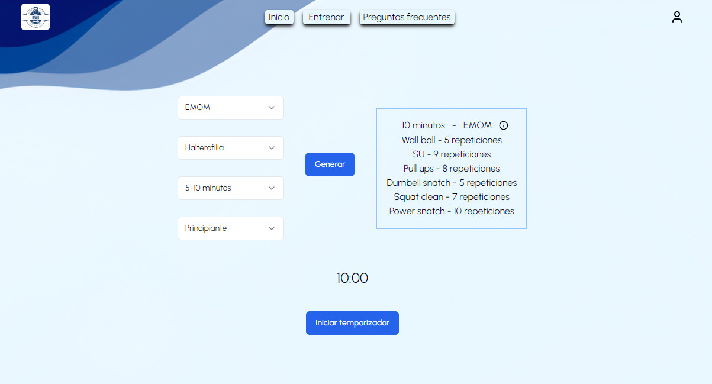

# Random WOD Generator
Este proyecto permite a los usuarios apasionados del CrossFit generar entrenamientos de forma aleatoria. La idea de este proyecto surge a raíz de la necesidad de tener una herramienta para esos días en los que quería entrenar, pero no sabía qué hacer.

## Tabla de contenidos
+ Demostración
+ Características
+ Instalación
+ Proceso de creación y tecnologías
+ Licencia
+ Autor

## Demostración

Como más vale un enlace que mil palabras, podéis encontrarlo aquí: https://random-wod-generator.vercel.app/


## Características
Las características principales con las que cuenta RWG son las siguientes:
+ Generador de entrenamientos aleatorio según el tipo de entrenamiento, el foco principal, el tiempo del que se dispone y el nivel del atleta.
+ Botón para guardar el entrenamiento como favorito.
+ Temporizador integrado que detecta el tiempo total del entrenamiento generado y está listo para iniciarlo, pausarlo o reiniciarlo según el usuario necesite.
+ Registro e inicio de sesión.
+ Perfil.
    + Sección de datos personales. Nos permite ver los datos básicos con los que nos registrados, además de cambiar la contraseña y cerrar la sesión.
    + Apartado de WOD favoritos. El icono mencionado anteriormente para guardar los entrenamientos como favoritos solo está disponible para los usuarios que hayan iniciado sesión previamente. Cada usuario podrá ver en este apartado del perfil todos los WOD favoritos, así como eliminar los que ya no quiera.
    + Registro de RM. En este apartado, el usuario puede ver una lista de todos los ejercicios disponibles para poder añadir el peso con el que hizo el entrenamiento la última vez o para registrar su repetición máxima.
    + Calculadora de calorías en función del objetivo. Este apartado permite al usuario según el género, la altura, la edad, la actividad y el objetivo físico, generar las calorías diarias necesarias.

## Instalación
+  Clona el repositorio
+ Abre el proyecto con tu editor favorito, como VS Code.
+ Instala todas las dependencias necesias mediante ```npm i``` 
+ Abre el proyecto en el navegador mediante ```npm run dev``` 
## Proceso de creación y tecnologías
Las tecnologías utilizadas para este proyecto son las siguientes:
- Next.js. Gracias a Next.js he podido crear una navegación sencilla entre las diferentes pantallas de la web, además de una integración con el back-end fácil y sencilla.
- TypeScript. Gracias a Typescript he podido crear un código más seguro y robusto, evitando errores menores a lo largo de todo el proceso de creación.
- MySQL. Gracias a MySQL he podido hacer un proyecto mucho más completo, implementando el apartado del registro y el inicio de sesión, además de poder guardar entrenamientos y marcas en el perfil de cada usuario.
- Shadcn me ha permitido implementar componentes de forma sencilla para darle un aspecto más cohesionado a toda la web.
## Licencia
Este proyecto está bajo la licencia MIT.
## Autora
Hecho con ❤️ y 💪 por mí, Teresa Toledo.